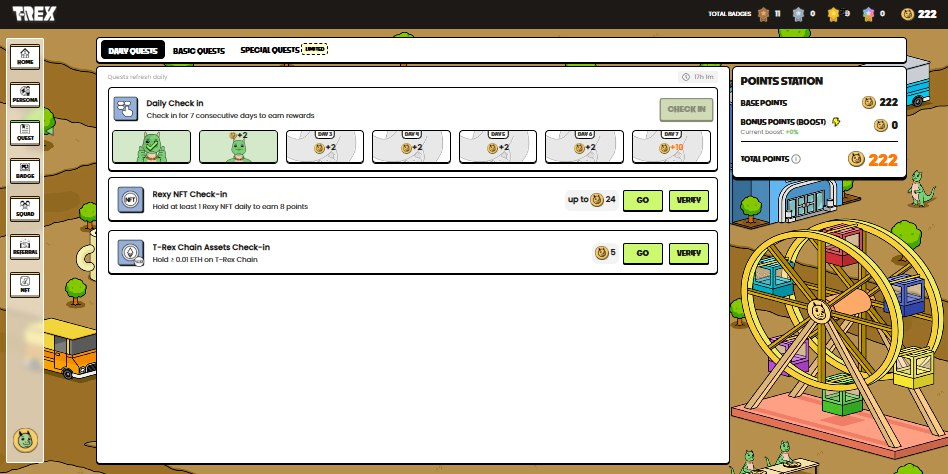

# AUTOMATION Trex + Google

## ⚠ Lưu ý quan trọng

🔴 **Tool sẽ tự tải phiên bản chromium 142.**

Để đảm bảo automation hoạt động ổn định, yêu cầu sử dụng Chrome/Chromium phiên bản 142.

Trong trường hợp quá trình tải tự động thất bại, tool sẽ mặc định sử dụng Chrome đã được cài sẵn trên máy tính.

[Nguồn tải chromium](https://github.com/macchrome/winchrome/releases)

---

## 📖 Mục lục
1. [Giới thiệu](#-giới-thiệu)
2. [Video demo](#-video-demo)
3. [Chức năng chính](#-chức-năng-chính)
4. [Yêu cầu ban đầu](#-yêu-cầu-ban-đầu)
5. [Cấu trúc file](#-cấu-trúc-file)
6. [Hướng dẫn cài đặt](#-hướng-dẫn-cài-đặt)
7. [Hướng dẫn sử dụng](#-hướng-dẫn-sử-dụng)
8. [Tips](#-tips)
9. [Thông tin liên hệ](#-thông-tin-liên-hệ)

## 🔔 Bật thông báo để theo dõi mã nguồn khi có update

1. Đăng nhập vào GitHub.
2. Nhấn vào biểu tượng 🔔 **Watch** (góc trên bên phải của repository này).
3. Chọn **"All Activity"** để nhận tất cả thông báo hoặc **"Custom" > "Pull Requests"** để nhận thông báo khi có thay đổi trong mã nguồn.

---

## 🌐 Giới thiệu

📌 **Trang dự án**: [trex.xyz](https://s.trex.xyz/lliZUv)

<p align="center">
    
</p>

---

## 🎬 Video demo

<p align="center">
    <a href="https://youtu.be/4hXiktO7X2M">
        
    </a>
</p>

---

## 🚀 Chức năng chính

- **Đăng nhập Google**: Khi cung cấp mật khẩu Google, tool sẽ tự động đăng nhập tài khảon google. (Chạy chế độ ẩn duyệt trình --headless, không thể đăng nhập được)
- **Login và làm task**: check-in hằng ngày

---

## 🔧 Yêu cầu ban đầu

- **Google**: Đăng nhập trước google (nếu không cung cấp mật khấu)

---

## 📂 Cấu trúc file

| File                             | Mô tả                                      |
| -------------------------------- | ------------------------------------------ |
| `googl.py`                       | Xử lý các thao tác liên quan đến Google.   |
| `index.py`                       | File khởi chạy chương trình chính.         |
| `config_example.txt`             | File cấu hình mẫu cho tool.                |
| `intro.png`                      | Hình ảnh giới thiệu.                       |
| `run_menu.bat`                   | Chạy code với 1 click.                     |
| `run_hidden.vbs`                 | Chạy code với Task scheduler (window).     |

---

## 📌 Hướng dẫn cài đặt

### 1️⃣ Cài đặt Python & thư viện

Trước tiên, cần cài đặt **Python 3.8+**.  
Nếu chưa có, hãy tải và cài đặt từ [Python Official Site](https://www.python.org/downloads/).

#### 🔹 Kiểm tra phiên bản Python
```sh
python --version
````

hoặc:

```sh
py --version
python3 --version
```

#### 🔹 Các bước cài đặt dự án

1. **Tải hoặc clone dự án**

   - **Cách 1**: Tải trực tiếp chương trình **ToolManager.exe** tại:  
     👉 [Download ToolManager.exe](https://github.com/tranledienlam/gui_automation/tree/main/dist)

   - **Cách 2**: Clone source code từ GitHub:
     ```sh
     git clone https://github.com/tranledienlam/selenium-kindredlabs-gg.git
     cd selenium-kindredlabs-gg
     ```

2. **Tạo môi trường ảo**

   ```sh
   python -m venv venv-browserkit0.3.0
   ```

3. **Kích hoạt môi trường ảo**

   * **Windows**

     ```sh
     venv-browserkit0.3.0\Scripts\activate
     ```
   * **Linux/macOS**

     ```sh
     source venv-browserkit0.3.0/bin/activate
     ```

4. **Cài đặt thư viện**

   ```sh
   pip install selenium-browserkit==0.3.0
   ```

5. **(Tuỳ chọn) Cài đặt từ source**

   ```sh
   pip install -e .
   ```

6. **Sau khi cài đặt thành công, hãy kiểm tra bằng:**

    ```sh
    pip show selenium-browserkit
    ```

### 2️⃣ Tạo file `data.txt`.

- Mỗi dòng chứa thông tin một profile theo cấu trúc:
  ```plaintext
  <tên_profile>|<email>|<mật_khẩu_email (tùy chọn 1)>|<proxy (tuỳ chọn)>
  ```

  Trong đó:

    - `tên_profile`: Tên của profile.
    - `email`: địa chỉ gmail.
    - `mật_khẩu_email (tùy chọn 1)`: mật khẩu đăng nhập gmail. (Nếu không cung cấp, hãy thực hiện đăng nhập thủ công)
    - `proxy (tuỳ chọn)`: Có thể là một trong hai dạng sau:
      - `ip:port` → Proxy không có xác thực.
      - `user:pass@ip:port` → Proxy có xác thực bằng tài khoản & mật khẩu.

- Ví dụ:
  ```plaintext
  profile1|email1@gmail.com|111111|38.154.227.167:2534  // Đầy đủ
  profile2|email2@gmail.com|111111                      // không proxy
  profile3|email3@gmail.com                             // Không mật khẩu email, không proxy
  ```

### 3️⃣ Chỉnh sửa cấu hình file `config.txt`.

**Bước 1**: Đổi tên file `config_example.txt` thành `config.txt`

**Bước 2**: Chỉnh sửa file `config.txt` theo hướng dẫn dưới đây:

#### 🔹 **Thay đổi số lượng profile chạy đồng thời**
- **Mục đích**: Số lượng profiles chạy cùng lúc (mặc định là 4).
- **Cách cấu hình**: 
  ```plaintext
  MAX_PROFLIES==<số_lượng (tùy chọn)>
  ```
- **Ví dụ**:
  ```plaintext
  MAX_PROFLIES=10
  ```
- **Lưu ý**: 
Hầu hết trường hợp bị lỗi là do quá trình load chậm khi chạy nhiều profile cùng lúc. Tuỳ thuộc vào tài nguyên máy tính và tốc độ internet, hãy điều chỉnh con số thích hợp.

#### 📁 **Cấu hình đường dẫn lưu profile**
- **Mục đích**: Chỉ định nơi lưu trữ dữ liệu profile
- **Cách cấu hình**:
  ```plaintext
  USER_DATA_DIR=<đường_dẫn>
  ```
- **Ví dụ**:
  ```plaintext
  USER_DATA_DIR=E:\profiles\discord
  ```
- **Lưu ý**: Để trống để sử dụng thư mục mặc định (cùng thư mục với tool)

#### 📱 **Cấu hình Telegram Bot (Khuyến nghị)**
- **Mục đích**: Gửi ảnh chụp màn hình đến Telegram cá nhân trong quá trình thực thi
- **Cách cấu hình**: 
  ```plaintext
  TELE_BOT=<USER_ID>|<BOT_TOKEN>|<ENDPOINT_URL (tùy chọn)>
  ```
- **Ví dụ**:
  ```plaintext
  TELE_BOT=1234567890|1235647890:AAFce0bukTPYase66cr_PH_ahBaCdU36xyc
  ```
- **Lưu ý**: 
  - Có thể thêm nhiều dòng `TELE_BOT` khác nhau
  - Tool sẽ ưu tiên sử dụng bot từ trên xuống
  - `ENDPOINT_URL` chỉ cần thiết khi Telegram bị chặn

  👉 [Hướng dẫn lấy token TELE_BOT và ENDPOINT_URL](#1️⃣-cấu-hình-tele_bot-trong-file-configtxt-để-theo-dõi-lỗi)

#### 🤖 **Cấu hình AI Bot (tool này không cần)**
- **Mục đích**: Thực hiện các chức năng đặc biệt
- **Cách cấu hình**:
  ```plaintext
  AI_BOT=<AI_BOT_TOKEN>
  ```
- **Ví dụ**:
  ```plaintext
  AI_BOT=AIzjSyAxmkXl_3aixsTcRAJSabUeLmzsSz0ovAg
  ```

  👉 [Hướng dẫn lấy AI_BOT_TOKEN](#2️⃣-cấu-hình-ai_bot-trong-file-configtxt-khi-tool-cần-thực-hiện-chức-năng-riêng-biệt) (Tool này không cần Bot AI, bỏ qua)

#### 🌐 **Cấu hình Proxy (Tùy chọn)**
- **Mục đích**: Dùng proxy dự phòng khi profile không có proxy hoặc proxy bị lỗi.
- **Cách cấu hình**: 
  ```plaintext
  PROXY=<proxy_string>
  ```
- Định dạng hỗ trợ:
  - ip:port
  - ip:port@username:password
  - username:password@ip:port
- **Ví dụ**:
  ```plaintext
  PROXY=38.153.152.244:9594
  PROXY=38.153.152.244:9594@user:pass
  PROXY=user:pass@38.153.152.244:9594
  ```

#### 🐍 **Cấu hình đường dẫn Python**
- **Mục đích**: Chỉ định môi trường Python để chạy tool
- **Cách cấu hình**:
  ```plaintext
  PYTHON_PATH=<đường_dẫn_python>
  ```
- **Ví dụ**:
  ```plaintext
  PYTHON_PATH=E:\venv\Scripts\python.exe
  ```
- **Lưu ý**: Để trống để sử dụng Python hệ thống


## ▶ Hướng dẫn sử dụng

### 1️⃣ Chạy chương trình

⚠️ Lưu ý: Cần chọn đúng môi trường Python (hoặc kích hoạt virtualenv) trước khi chạy.

### Lệnh cơ bản
```sh
python index.py
```

Tuỳ chọn khác

```sh
# Bỏ qua menu và chạy tự động tất cả các profile.
python index.py --auto 

# Chạy tự động ở chế độ ẩn trình duyệt (headless)
python index.py --auto --headless

# Chạy ở chế độ tắt GPU (dùng cho VPS / server không có GPU vật lý)
python index.py --disable-gpu
```

### 2️⃣ Các chế độ hoạt động

- **1. Set up**: Chạy chế độ cài đặt ban đầu và chọn profile.
- **2. Chạy Auto**: Chạy chế độ tự động theo cấu hình đã thiết lập.
- **3. Xoá profile**: Chọn xoá profile trong thư mục `user_data` (Nếu có).
- **0. Thoát**: Dừng chương trình.

**💡 Lưu ý:**

- **Lần đầu:** Chạy **Set up (1)** để thiết lập cấu hình cần thiết.
- **Những lần sau:** Chạy **Auto (2)** để tự động thực thi theo luồng đã lập trình.

--- 

## 🎯 Tips

### 1️⃣ Cấu hình `TELE_BOT` trong file `config.txt` để theo dõi lỗi.

- Mỗi dự án có một bot Telegram riêng, giúp theo dõi lỗi dễ dàng hơn.
- **Hướng dẫn lấy token Telegram:** Truy cập [channel](https://t.me/+8o9ebAT9ZSFlZGNl), tìm bài viết `Cách lấy thông tin cho file config.txt`. ([Video hướng dẫn](https://www.youtube.com/watch?v=2lAiI-s04gY&t=5s))
- **Hướng dẫn lấy ENDPOINT_URL:** ([Video hướng dẫn](https://www.youtube.com/watch?v=2lAiI-s04gY&t=115s)) Dành cho trường hợp khi Telegram bị chặn.

### 2️⃣ Cấu hình `AI_BOT` trong file `config.txt` khi tool cần thực hiện chức năng riêng biệt.

- **Hướng dẫn lấy token AI bot:**
  - Truy cập [aistudio google](https://aistudio.google.com/apikey)
  - Chọn/Nhấn "Create API Key"
  - Copy "API key"

- **Lưu ý:**
  - Source dùng model `gemini-2.0-flash`.
  - Với gói miễn phí, chạy được khoảng 20-30 dự án/ngày, cho 5-10 profiles/dự án, tương đương khởi chạy **300 lần profile/ngày**

### 3️⃣ Tự động hóa với một cú click (Chỉ áp dụng cho Windows)

Để chạy chương trình đơn giản hơn, bạn có thể sử dụng file `run_menu.bat` bằng cách click đúp chuột trực tiếp vào file, thay vì phải mở code và gõ lệnh trong CMD.

### 4️⃣ Chạy tự động ẩn với Windows Task Scheduler

1. Mở **Task Scheduler** bằng cách tìm kiếm trên Windows.
2. Menu > Action > **Create Task..**.
3. Tab **General**: đặt tên cho task
4. Tab **Triggers**: thiết lập lịch chạy
  - Click **New...**
  - Tại **Begin the task**: chọn **At startup** để chạy khi khởi động Windows, hoặc **On a schedule** để đặt lịch cụ thể.
  - Chọn **Enabled** để kích hoạt trigger.
5. Tab **Actions**: thiết lập chương trình chạy
  - Click **New...**
  - **Action**: chọn **Start a Program**
  - **Program/script**: nhập `wscript.exe`
  - **Add arguments**: dán đường dẫn đầy đủ tới file `run_hidden.vbs`
6. Tab **Conditions** (optional): 
  - Bỏ chọn **Start the task only if the computer is on AC power**
  - Bỏ chọn **Stop if the computer switches to battery power**
7. Tab **Settings** (optional):
  - Chọn **Run task as soon as possible after a scheduled start is missed**
  - Chọn **If the task fails, restart every: 1 minute** và **Attempt to restart up to: 3 times**
8. Click **OK** để lưu task.

Bây giờ, chương trình sẽ tự động chạy ẩn dưới nền window theo lịch trình đặt trước. 🚀

---

## 🔗 Thông tin liên hệ

📢 **Telegram Channel:** [Airdrop Automation](https://t.me/+8o9ebAT9ZSFlZGNl)

💰 **Ủng hộ tác giả:**

- **EVM:** `0x3b3784f7b0fed3a8ecdd46c80097a781a6afdb09`
- **SOL:** `4z3JQNeTnMSHYeg9FjRmXYrQrPHBnPg3zNKisAJjobSP`
- **TON:** `UQDKgC6TesJJU9TilGYoZfj5YYtIzePhdzSDJTctJ-Z27lkR`
- **SUI:** `0x5fb56584bf561a4a0889e35a96ef3e6595c7ebd13294be436ad61eaf04be4b09`
- **APT (APTOS):** `0x557ea46189398da1ddf817a634fa91cfb54a32cfc22cadd98bb0327c880bac19`

🙏 Khi ủng hộ, nếu không thấy phiền, Bạn có thể gửi token chính của mạng. Cám ơn Bạn đã hỗ trợ!